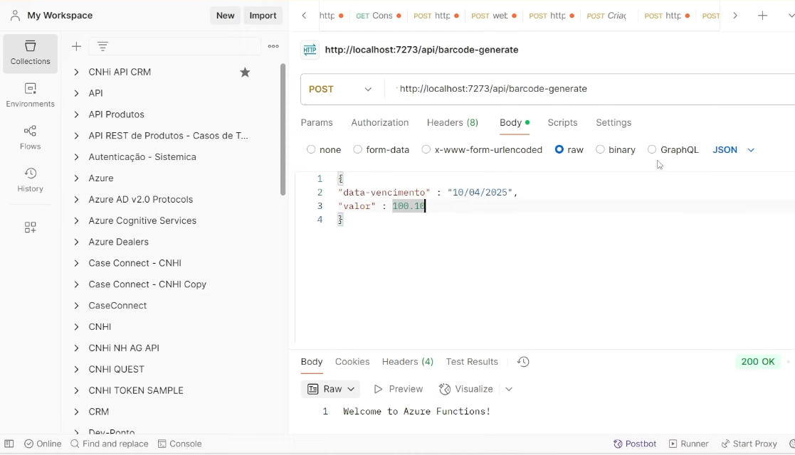

# autenticador-boletos
Projeto Criando um Serviço Autenticador de Boleto - Exercício DIO Bootcamp

1. Criar functions no Azure
- nome da função: fn gerador de boletos
- no ambiente de edição da function:
- instalar dependencias
- instalar Newtonsoft.Json
- instalar BarcodeLib
- inclui o código do servicebus (ver figura) e cria-se, no Azure, o servicebus (ver figura)

2. Criar o Boleto no Azure e no Código

3. Criar o validador do Boleto no Azure Functions  e no Código

4. Criar camada User Interface
- usando o Copilot para isso (ver imagem)

5. Validação da camada User Interface (também com o Copilot)

IMAGENS EXEMPLOS:

- Criando function no Azure:

- Edição código da function no Azure:

- Criando boleto

